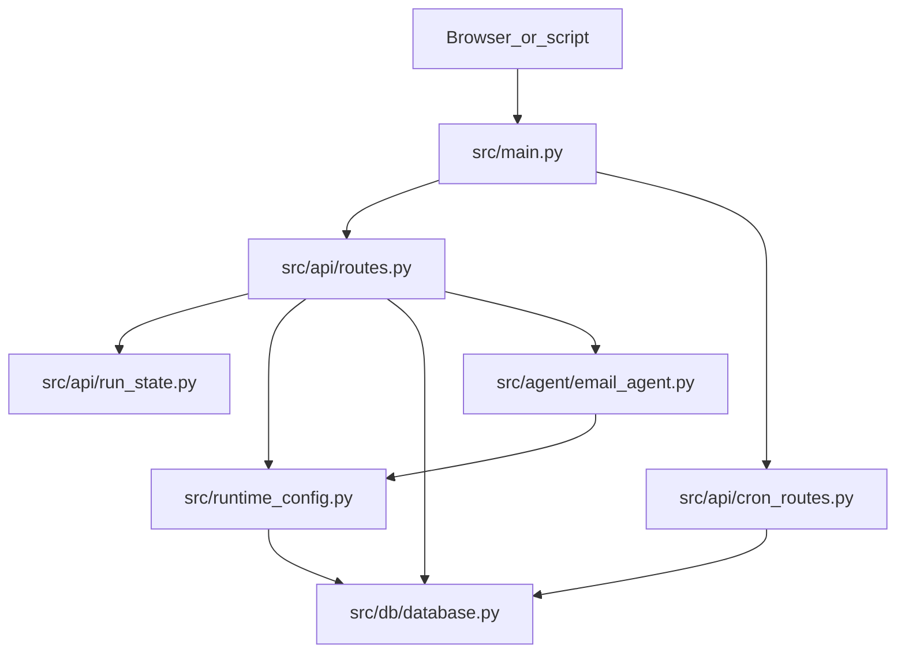
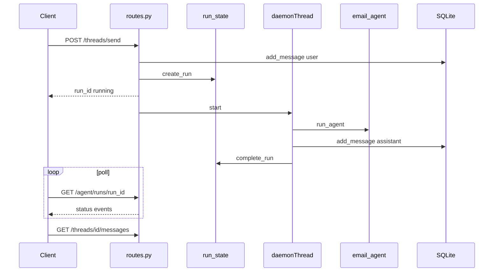

# Sova HTTP API Reference

Human-readable reference for the **FastAPI** layer in **Sova — CSM Radar Agent 24/7**. Use this doc to understand **what the HTTP API does**, **which product workflows it serves**, and **how to call it**.

For agent behavior (probe merge, guardrails, retrieval pipelines), see **[ARCHITECTURE.md](ARCHITECTURE.md)**. For dashboard card fields, see **[ACTION_CARD_SPEC.md](ACTION_CARD_SPEC.md)**.

**Source of truth (code):** [src/api/routes.py](../src/api/routes.py), [src/api/cron_routes.py](../src/api/cron_routes.py), [src/main.py](../src/main.py).

---

## Role of the API

Sova runs as a **single-process** server. The HTTP layer sits between the browser (or scripts) and the agent, database, and scheduler:



The API **orchestrates** work: it persists threads and settings, starts agent runs in background threads, exposes run traces for the UI, and delegates LLM/retrieval logic to the agent layer — it does not implement retrieval or probe merge itself.

---

## Conventions

| Topic | Detail |
|-------|--------|
| **Base URL** | `http://127.0.0.1:8000` by default (`HOST` / `PORT` in [src/config.py](../src/config.py)) |
| **Content type** | JSON request/response bodies unless noted (e.g. multipart upload) |
| **Authentication** | None — local operator console; bind to localhost in production |
| **Errors** | FastAPI `HTTPException`: `400` (bad input), `404` (not found), `500` (server/agent failure) |
| **Configure cache** | `GET/PATCH /settings/runtime` responses include `Cache-Control: no-store` |
| **Machine schema** | When the server is running, FastAPI exposes **`GET /openapi.json`** (generated from Pydantic models in routes) |

**Settings layering:** Environment variables and defaults live in `src/config.py`. Values saved via **Configure** (`PATCH /settings/runtime`) are stored in SQLite `app_settings` and override env at runtime through `src/runtime_config.py` (`effective_*()` helpers).

---

## Request patterns

Most UI flows use **async + poll**. Legacy/script callers may use the synchronous agent endpoint.

### Sync — block until done

| Endpoint | Returns |
|----------|---------|
| `POST /agent/run` | `{ "output": "...", "status": "completed" }` |

The handler runs `run_agent()` in the request thread. On probe runs, output is merged into dashboard metadata before the interaction is logged.

### Async + poll — primary Workbench pattern

| Step | Endpoint | Notes |
|------|----------|-------|
| 1. Start | `POST /threads/send` or `POST /agent/run_async` | Returns `{ "run_id": "<uuid>", "status": "running" }` immediately |
| 2. Poll | `GET /agent/runs/{run_id}` | Read `status`, `events`, `output`, `error` |
| 3. Cancel (optional) | `POST /agent/runs/{run_id}/cancel` | Cooperative stop between LLM/tool steps |
| 4. Reload UI data | e.g. `GET /threads/{id}/messages` | Assistant message is persisted **before** run status flips to `completed` |

Worker runs in a **daemon `Thread`** ([src/api/routes.py](../src/api/routes.py)); trace events are written to in-memory [src/api/run_state.py](../src/api/run_state.py).



### Run state contract (`run_state`)

In-memory only — **lost on server restart**. Capped at 500 runs (oldest terminal runs evicted first; queued/running rows are never dropped).

| Field | Description |
|-------|-------------|
| `run_id` | UUID string |
| `status` | `queued` → `running` → `completed` \| `error` \| `cancelled` |
| `trigger_type` | e.g. `thread_message`, `thread_probe`, `manual`, `manual_probe` |
| `input_text` | Truncated input logged for the run |
| `output` | Final agent output (when completed) |
| `error` | Error message (when `error` or `cancelled`) |
| `events` | List of `{ "ts", "type", "title", "detail" }` — tool/LLM trace for the UI |
| `cancel_requested` | Set when cancel endpoint is called |

Event `type` values include `model_start`, `model_end`, `tool_start`, `tool_end`, `chain_start`, `chain_end`, `run_cancelled`.

---

## Use cases

### Workbench and threads

**Purpose:** Interactive chat with the CSM agent, inbox scan (probe), and scoped **action-review** threads for one dashboard card.

**UI tab:** Workbench

| Method | Path | Pattern | Description |
|--------|------|---------|-------------|
| `GET` | `/threads` | sync | List threads (`limit`, `offset`, optional `q` search) |
| `POST` | `/threads` | sync | Create thread |
| `GET` | `/threads/{thread_id}/messages` | sync | List messages in a thread |
| `DELETE` | `/threads/{thread_id}` | sync | Delete one thread and its messages |
| `POST` | `/threads/bulk-delete` | sync | Delete up to 200 threads by id |
| `POST` | `/threads/send` | **async** | Send user message or trigger probe — **primary Workbench entry** |
| `POST` | `/threads/action-review` | sync | Open or reuse a thread scoped to one dashboard action |

#### `POST /threads` — body

```json
{
  "title": "Optional title",
  "pinned": false,
  "metadata": {}
}
```

#### `POST /threads/send` — body

```json
{
  "thread_id": 1,
  "text": "What needs attention in my inbox?",
  "probe": false,
  "ui_locale": "en"
}
```

| Field | Notes |
|-------|-------|
| `thread_id` | Required — existing Workbench thread |
| `text` | User message; may be empty when `probe: true` |
| `probe` | `true` → full inbox probe (Scan inbox) |
| `ui_locale` | Optional `en` \| `ko` — probe language hints |

**Server-side routing** (before the worker starts):

| Condition | `trigger_type` | Agent mode |
|-----------|----------------|------------|
| `probe: true` | `thread_probe` | Full probe — no thread history; probe trigger message; dashboard merge |
| NL intent classifier matches inbox probe intent | `thread_probe` | Same as above (`auto_probe_from_chat` on user message metadata) |
| Thread `metadata.kind == action_review` | `thread_message` | Chat with action-review system append + hydration; **never** auto-probe |
| Cron admin NL patterns | `thread_cron_admin` | Handled inside `run_agent` |
| Default | `thread_message` | Normal chat with thread history and tools |

Probe behavior (preflight skip, merge, guardrails): **[ARCHITECTURE.md § Workbench threads vs full inbox probe](ARCHITECTURE.md#workbench-threads-vs-full-inbox-probe)**.

#### `POST /threads/action-review` — body

```json
{
  "source_interaction_id": 42,
  "action_index": 0
}
```

Returns `{ "thread": {...}, "created": true|false }`. Creates a thread with `metadata.kind: action_review` and a seeded system message when new.

#### `POST /threads/bulk-delete` — body

```json
{ "thread_ids": [1, 2, 3] }
```

---

### Agent runs (legacy / direct)

**Purpose:** Run the agent without a Workbench thread — scripts, older clients, or quick probes.

**UI tab:** Mostly internal; Run history shows logged interactions

| Method | Path | Pattern | Description |
|--------|------|---------|-------------|
| `POST` | `/agent/run` | sync | Run agent or probe; returns output inline |
| `POST` | `/agent/run_async` | async | Same as sync but returns `run_id` for polling |
| `GET` | `/agent/runs/{run_id}` | sync | Poll one run |
| `GET` | `/agent/runs` | sync | List recent runs (`limit`, `status` filter) |
| `POST` | `/agent/runs/{run_id}/cancel` | sync | Request cooperative cancellation |

#### `POST /agent/run` and `POST /agent/run_async` — body

```json
{
  "input": "Hello",
  "probe": false,
  "web": false,
  "web_url": null,
  "ui_locale": null
}
```

| Field | Notes |
|-------|-------|
| `probe` | `true` → probe mode; `input` ignored in favor of configured probe trigger message |
| `web` | `true` → skip agent; run hosted web search only (`web_url` optional) |

---

### Agent profile

**Purpose:** Vendor, product context, and role title injected into agent prompts.

**UI tab:** Workbench (profile panel)

| Method | Path | Description |
|--------|------|-------------|
| `GET` | `/agent/profile` | Read current profile from DB |
| `PUT` | `/agent/profile` | Update profile |

#### `PUT /agent/profile` — body

```json
{
  "vendor_name": "Appier",
  "product_context": "AIRIS, AIQUA, BotBonnie",
  "role_title": "CSM Assistant"
}
```

---

### Action dashboard

**Purpose:** Queue of structured **action cards** from inbox probe runs; operator edits status, category, and priority.

**UI tab:** Action dashboard

| Method | Path | Description |
|--------|------|-------------|
| `GET` | `/dashboard/probe-runs` | List probe interactions with `csm_actions` metadata |
| `PATCH` | `/dashboard/probe-runs/{interaction_id}/actions/{action_index}/status` | `not_started` \| `in_progress` \| `completed` |
| `PATCH` | `/dashboard/probe-runs/{interaction_id}/actions/{action_index}/category` | `client_technical` \| `client_non_technical` \| `internal` |
| `PATCH` | `/dashboard/probe-runs/{interaction_id}/actions/{action_index}/priority` | `low` \| `medium` \| `high` \| `urgent` |
| `DELETE` | `/dashboard/probe-runs/{interaction_id}/actions/{action_index}` | Remove one card from the run |
| `DELETE` | `/dashboard/probe-runs/{interaction_id}` | Hide entire run from dashboard (row stays in Run history) |

#### `GET /dashboard/probe-runs` — query params

| Param | Values |
|-------|--------|
| `limit` | 1–100 (default 20) |
| `offset` | Pagination offset |
| `source` | `all`, or comma-separated: `cron`, `thread_probe`, `manual_probe` |
| `status` | `all`, or comma-separated: `completed`, `error` |

Response: `{ "items": [...], "limit", "offset", "has_more" }`.

Card field semantics: **[ACTION_CARD_SPEC.md](ACTION_CARD_SPEC.md)**. Relevance/guardrail policy at merge time: **[AGENT_GUARDRAILS.md](AGENT_GUARDRAILS.md)**.

---

### Configure (runtime settings)

**Purpose:** Operator overrides for models, keys, Gmail paths, guardrails, prompts, and retrieval policy — persisted in `app_settings`.

**UI tab:** Configure

| Method | Path | Description |
|--------|------|-------------|
| `GET` | `/settings/runtime` | Effective settings snapshot for the UI (env + DB merged) |
| `PATCH` | `/settings/runtime` | Save one or more Configure fields |
| `POST` | `/settings/runtime/clear-overrides` | Remove all Configure keys from DB; revert to env defaults |

`GET` returns a large JSON object including `effective`, `configure_encryption_enabled`, `distilled_learning`, `prompt_effective_by_mode`, and UI hints.

#### `PATCH /settings/runtime` — patchable fields (groups)

Send only fields you want to change. Empty string on a prompt library key re-seeds the bundled default from `src/agent/prompts.py`.

| Group | Fields |
|-------|--------|
| **LLM provider** | `llm_provider_preset`, `llm_model`, `llm_model_main`, `llm_model_search_json`, `llm_model_kb_web_gate`, `llm_model_search_rerank`, `llm_model_memory` |
| **Retrieval** | `rc_web_retrieval_mode`, `retrieval_ranking_policy`, `rag_embedding_provider`, `rag_embedding_model` |
| **API keys** | `openrouter_api_key`, `openai_api_key`, `openrouter_base_url` |
| **Gmail / gog** | `gog_home`, `gog_account`, `gog_keyring_backend`, `gog_keyring_password`, `xdg_config_home`, `gog_credentials_path` |
| **Scheduler / probe** | `scheduler_timezone`, `probe_inbox_max_results`, `probe_inbox_gmail_search`, `user_inbox_peek_max_results` |
| **Guardrails** | `guardrail_include_sender_domains`, `guardrail_exclude_sender_domains`, `guardrail_include_intent_keywords`, `guardrail_exclude_intent_keywords`, `guardrail_team_guidance`, `guardrail_strictness`, `customer_email_domains` |
| **Prompt templates** | `prompt_email_agent_system_template`, `prompt_probe_user_message`, `prompt_probe_mode_append`, `prompt_action_review_append` |
| **RC web limits** | `rc_url_tree_max_depth`, `rc_url_tree_max_urls`, `rc_web_visit_limit` |
| **LangSmith** | `langsmith_tracing`, `langsmith_api_key`, `langsmith_project` |

Prompt key semantics: **[PROMPTS.md](PROMPTS.md)**. Model roles: **[LLM_MODELS.md](LLM_MODELS.md)**.

Guardrail text fields may be encrypted at rest when `CONFIGURE_ENCRYPTION_KEY` is set ([src/configure_crypto.py](../src/configure_crypto.py)).

---

### Knowledge base

**Purpose:** Upload documents, list registered files, rebuild search indexes.

**UI tab:** Knowledge

| Method | Path | Description |
|--------|------|-------------|
| `POST` | `/docs/upload` | Multipart file upload → ingest into KB path |
| `GET` | `/kb/documents` | List registered documents (`limit`, `offset`) |
| `DELETE` | `/kb/documents/{doc_id}` | Remove document registration and file |
| `POST` | `/kb/reindex` | Rebuild vector/FTS indexes from registered docs |

Upload supports `.md`, `.txt`, and best-effort fallback for other extensions.

---

### RC URLs and URL tree

**Purpose:** Configure allowed hosts for **`search_rc_web`** and discover crawlable URL trees for LLM URL picking.

**UI tab:** Knowledge (RC URLs section)

| Method | Path | Pattern | Description |
|--------|------|---------|-------------|
| `GET` | `/rc/urls` | sync | List RC URL rows |
| `POST` | `/rc/urls` | sync | Upsert URL (enable/disable, title, tags, scope) |
| `PATCH` | `/rc/urls` | sync | Update existing URL metadata |
| `DELETE` | `/rc/urls` | sync | Delete by `url` query param |
| `POST` | `/rc/discover` | sync | Synchronous URL-tree discovery (legacy) |
| `POST` | `/rc/tree/discover` | async | Background tree discovery — poll `/rc/tree/status` |
| `GET` | `/rc/tree/status` | sync | Discovery job status for a `base_url` |
| `GET` | `/rc/tree` | sync | List stored tree nodes for a `base_url` |

#### `POST /rc/urls` — body

```json
{
  "url": "https://docs.example.com",
  "title": "Product docs",
  "tags": ["api"],
  "scope": "product_a",
  "enabled": true
}
```

#### `POST /rc/tree/discover` — body

```json
{
  "base_url": "https://docs.example.com",
  "max_urls": 300,
  "max_depth": 2
}
```

Returns `{ "base_url", "status": "running", ... }`. Poll `GET /rc/tree/status?base_url=...` until `status` is `ready` or `error`.

---

### Memory, feedback, and learning

**Purpose:** Operator feedback on runs and dashboard cards; distilled learning rules injected into agent prompts.

**UI tab:** Run history, Action dashboard (feedback), Configure (distilled rules)

| Method | Path | Description |
|--------|------|-------------|
| `POST` | `/memory/feedback` | Submit verdict + optional note/correction; triggers learning refresh |
| `GET` | `/memory/learning` | Read constraints, exemplars, merged instructions (**no LLM**) |
| `DELETE` | `/memory/learning` | Clear learning keys and **all** `agent_feedback` rows |
| `POST` | `/memory/refresh` | Run full learning reinforcement pipeline |
| `POST` | `/memory/compact` | Summarize old interactions into compact memory notes |

#### `POST /memory/feedback` — body

```json
{
  "interaction_id": 10,
  "verdict": "good",
  "note": "Helpful triage",
  "correction": null,
  "action_index": null,
  "metadata": { "source": "run_history" }
}
```

When `action_index` is set, feedback is scoped to one dashboard card (`source: action_dashboard` in stored metadata).

Learning pipeline details: **[ARCHITECTURE.md § Self-evolution and feedback](ARCHITECTURE.md#self-evolution-and-feedback)**.

#### `POST /memory/compact` — body

```json
{
  "before": "2025-01-01T00:00:00",
  "max_interactions": 200
}
```

---

### Run history

**Purpose:** Audit log of agent interactions (probe runs, thread messages, cron, manual API).

**UI tab:** Run history

| Method | Path | Description |
|--------|------|-------------|
| `GET` | `/interactions` | List interactions (`limit`, `offset`) |
| `DELETE` | `/interactions` | Delete all, or rows with `created_at` before `before` (ISO datetime query param) |

---

### Cron scheduling

**Purpose:** Scheduled inbox probe jobs (APScheduler in-process).

**UI tab:** Cron

| Method | Path | Description |
|--------|------|-------------|
| `GET` | `/cron` | List jobs with human-readable schedule and next run previews |
| `POST` | `/cron` | Create job |
| `PATCH` | `/cron/{name}` | Enable/disable job |
| `DELETE` | `/cron/{name}` | Remove job |
| `POST` | `/cron/{name}/run` | Trigger probe immediately |
| `GET` | `/cron/summary` | Recent cron run summary (`limit`) |

#### `POST /cron` — body

```json
{
  "name": "morning_probe",
  "cron_expression": "0 9 * * 1-5",
  "timezone": "Asia/Seoul"
}
```

#### `PATCH /cron/{name}` — body

```json
{ "enabled": true }
```

Cron probes use the same agent + merge pipeline as manual Scan inbox; `trigger_type` is `cron`.

---

### Maintenance

**Purpose:** Database size stats and retention cleanup.

| Method | Path | Description |
|--------|------|-------------|
| `GET` | `/maintenance/stats` | Table row counts and DB file size |
| `POST` | `/maintenance/optimize` | Prune old interactions/memory/feedback; optional vacuum |

#### `POST /maintenance/optimize` — body

```json
{
  "interactions_keep_days": 30,
  "memory_keep_days": 60,
  "feedback_keep_days": 120,
  "purge_memory_table": false,
  "delete_report_outputs": false,
  "vacuum": true
}
```

---

### Static UI and health

| Method | Path | Description |
|--------|------|-------------|
| `GET` | `/` | Serves Workbench SPA (`src/web/index.html`, no-cache) |
| `GET` | `/health` | `{ "status": "ok" }` — liveness check |
| `GET` | `/static/*` | Static assets under `src/web/` |
| `GET` | `/docs/*` | Markdown documentation files (this doc tree) |

Troubleshooting: **[OPERATIONS_RUNBOOK.md](OPERATIONS_RUNBOOK.md)**.

---

## Appendix — full route inventory

| Method | Path | Pattern | Primary delegate |
|--------|------|---------|------------------|
| `GET` | `/` | sync | Static UI |
| `GET` | `/health` | sync | Liveness |
| `POST` | `/agent/run` | sync | `run_agent` |
| `POST` | `/agent/run_async` | async | `run_agent` + `run_state` |
| `GET` | `/agent/runs` | sync | `run_state.list_runs` |
| `GET` | `/agent/runs/{run_id}` | sync | `run_state.get_run` |
| `POST` | `/agent/runs/{run_id}/cancel` | sync | `run_state.request_cancel` |
| `GET` | `/agent/profile` | sync | `database.get_agent_profile_settings` |
| `PUT` | `/agent/profile` | sync | `database.set_agent_profile_settings` |
| `GET` | `/settings/runtime` | sync | `runtime_settings_snapshot` |
| `PATCH` | `/settings/runtime` | sync | `persist_app_setting` |
| `POST` | `/settings/runtime/clear-overrides` | sync | `clear_runtime_configure_overrides` |
| `POST` | `/docs/upload` | sync | `ingest_upload` |
| `GET` | `/kb/documents` | sync | `database.list_kb_documents` |
| `DELETE` | `/kb/documents/{doc_id}` | sync | `database.delete_kb_document` |
| `POST` | `/kb/reindex` | sync | `doc_search.reindex_kb` |
| `GET` | `/rc/urls` | sync | `database.list_rc_urls` |
| `POST` | `/rc/urls` | sync | `database.upsert_rc_url` |
| `PATCH` | `/rc/urls` | sync | `database.upsert_rc_url` |
| `DELETE` | `/rc/urls` | sync | `database.delete_rc_url` |
| `POST` | `/rc/discover` | sync | `discover_url_tree` |
| `POST` | `/rc/tree/discover` | async | background tree worker |
| `GET` | `/rc/tree/status` | sync | in-memory discovery status |
| `GET` | `/rc/tree` | sync | `database.list_rc_url_tree` |
| `GET` | `/interactions` | sync | `database.get_interactions` |
| `DELETE` | `/interactions` | sync | `database.delete_interactions` |
| `GET` | `/dashboard/probe-runs` | sync | `database.list_probe_interactions` |
| `DELETE` | `/dashboard/probe-runs/{interaction_id}` | sync | `database.dismiss_probe_from_dashboard` |
| `DELETE` | `/dashboard/probe-runs/{interaction_id}/actions/{action_index}` | sync | `database.remove_csm_dashboard_action` |
| `PATCH` | `/dashboard/probe-runs/{interaction_id}/actions/{action_index}/status` | sync | `database.set_csm_dashboard_action_status` |
| `PATCH` | `/dashboard/probe-runs/{interaction_id}/actions/{action_index}/category` | sync | `database.set_csm_dashboard_action_category` |
| `PATCH` | `/dashboard/probe-runs/{interaction_id}/actions/{action_index}/priority` | sync | `database.set_csm_dashboard_action_priority` |
| `GET` | `/memory/learning` | sync | `database.get_agent_learning_instructions_snapshot` |
| `DELETE` | `/memory/learning` | sync | `clear_distilled_learning_instructions` |
| `POST` | `/memory/compact` | sync | `compact_memory` |
| `POST` | `/memory/feedback` | sync | `database.insert_feedback` + learning refresh |
| `POST` | `/memory/refresh` | sync | `refresh_learning_instructions` |
| `GET` | `/maintenance/stats` | sync | `database.db_stats` |
| `POST` | `/maintenance/optimize` | sync | `database.optimize_data_store` |
| `GET` | `/threads` | sync | `database.list_threads` |
| `POST` | `/threads` | sync | `database.create_thread` |
| `POST` | `/threads/action-review` | sync | action-review thread ensure/create |
| `GET` | `/threads/{thread_id}/messages` | sync | `database.list_messages` |
| `DELETE` | `/threads/{thread_id}` | sync | `database.delete_thread` |
| `POST` | `/threads/bulk-delete` | sync | `database.delete_threads` |
| `POST` | `/threads/send` | async | `run_agent` + thread persistence |
| `GET` | `/cron` | sync | `database.get_cron_jobs` |
| `POST` | `/cron` | sync | `cron_manager.add_job` |
| `PATCH` | `/cron/{name}` | sync | `cron_manager.toggle_job` |
| `DELETE` | `/cron/{name}` | sync | `cron_manager.remove_job` |
| `POST` | `/cron/{name}/run` | sync | `cron_manager._run_probe_job` |
| `GET` | `/cron/summary` | sync | `database.get_cron_run_summary` |

---

## Related documentation

| Doc | Use when you need |
|-----|-------------------|
| [ARCHITECTURE.md](ARCHITECTURE.md) | End-to-end runtime, probe vs chat, retrieval, learning pipeline |
| [ACTION_CARD_SPEC.md](ACTION_CARD_SPEC.md) | Dashboard card JSON fields |
| [AGENT_GUARDRAILS.md](AGENT_GUARDRAILS.md) | Include/exclude policy at merge time |
| [PROMPTS.md](PROMPTS.md) | Prompt template keys in Configure |
| [LLM_MODELS.md](LLM_MODELS.md) | Model roles and provider presets |
| [OPERATIONS_RUNBOOK.md](OPERATIONS_RUNBOOK.md) | Health checks and troubleshooting |
| [INSTALLATION.md](INSTALLATION.md) | Starting the server and first Configure |

---

## Keeping this doc in sync

When you add or change routes in `src/api/routes.py` or `src/api/cron_routes.py`:

1. Update the **Appendix** table and the relevant **Use case** section in this file.
2. Update **[ARCHITECTURE.md](ARCHITECTURE.md)** only when **behavior** changes (not for every new route).
