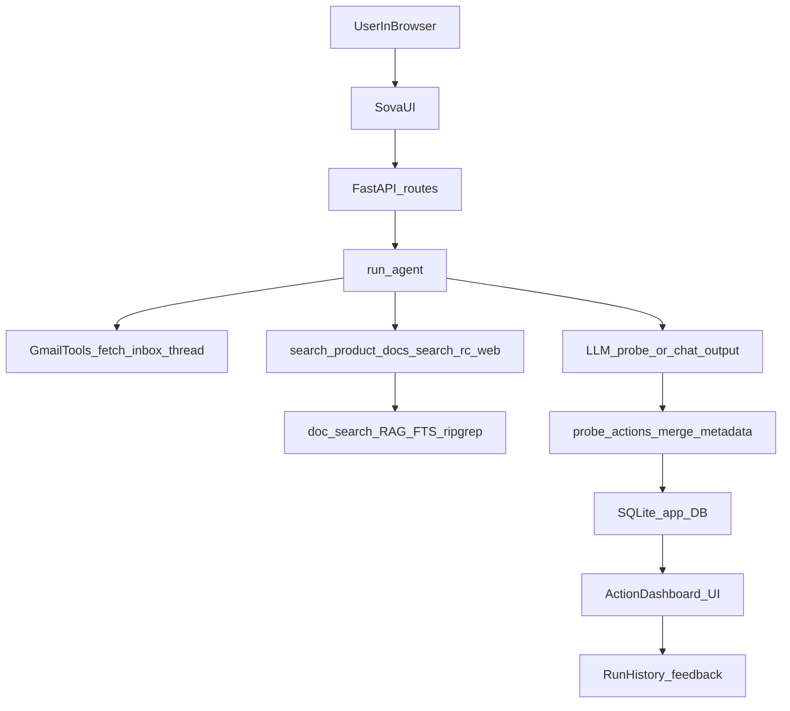
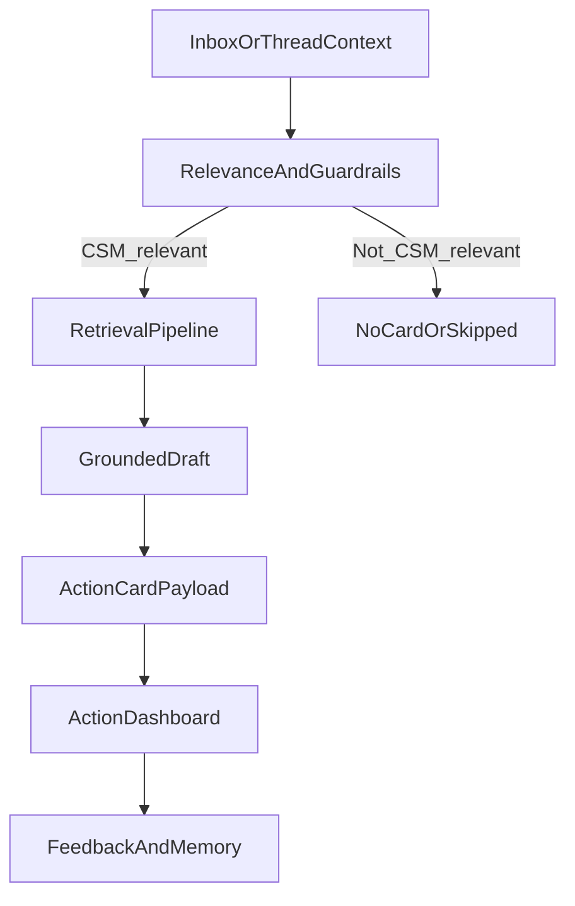

# Sova Architecture

End-to-end view of **Sova - CSM Radar Agent 24/7**: how the UI, API, agent, retrieval, probe merge, and persistence fit together. Use this doc with **[SEARCH_AGENT.md](SEARCH_AGENT.md)** (retrieval internals), **[PROMPTS.md](PROMPTS.md)** (prompt keys in `app_settings`), and **[LLM_MODELS.md](LLM_MODELS.md)** (model roles).

## System components

| Layer | Location |
|-------|----------|
| HTTP API + static UI | `src/main.py`, `src/api/` (including `routes.py`, `cron_routes.py`), `src/web/index.html` |
| Agent + tools | `src/agent/email_agent.py` (LangChain agent, tool wiring, intent routing) |
| Probe merge + guardrails | `src/agent/probe_actions.py` |
| Search orchestration | `src/agent/tools/search_agent.py` |
| Retrieval engines | `src/agent/tools/doc_search.py`, `src/agent/search_terms_extractor.py` |
| Gmail | `src/agent/tools/gmail_tool.py` → subprocess `scripts/gmail-get-decoded.py` + local `gog` |
| RC web | `src/agent/tools/rc_web_search.py` (KB-first, then enabled RC URLs) |
| Cron | `src/scheduler/`, `src/api/cron_routes.py` |
| DB + settings | `src/db/database.py`, `src/runtime_config.py`, `src/config.py` |
| Learning / memory | `src/agent/memory.py` + `/memory/*` routes |

There are **no separate long-running “subagent” processes**. “Subagents” in the product sense are **orchestrated stages** inside `search_agent.py` (subqueries, rerank, sufficiency) and **tools** bound to the **same** LangChain agent in `email_agent.py`.

## Product flow (inbox to dashboard)

High-level path from operator action to stored action cards:

**Relevance and guardrails** (which rows become dashboard cards) run at **merge** time using model fields plus Configure policy—see [AGENT_GUARDRAILS.md](AGENT_GUARDRAILS.md) and [ACTION_CARD_SPEC.md](ACTION_CARD_SPEC.md).

## API request paths (what the server runs)

Common entrypoints (not exhaustive; see `src/api/routes.py`):

| Route / area | Role |
|--------------|------|
| `POST /threads/send` | Workbench message or implicit full probe (see below); persists messages and `agent_interactions` |
| `POST /threads/bulk-delete` | Deletes many threads + messages + linked run rows (Workbench cleanup) |
| `POST /agent/run` | Manual agent or probe from API / older clients |
| `GET/POST` cron + scheduler | Scheduled inbox probes and job management |
| `POST /memory/feedback`, `/memory/refresh`, `/memory/compact` | Feedback and learning-memory maintenance |
| `PATCH /settings/runtime` | **Configure** saves overrides into `app_settings` (via runtime config) |

## Workbench threads vs full inbox probe

**Workbench** (`POST /threads/send` with user text) normally runs **`run_agent(..., probe=False)`** with **thread history** so the model can chat, use tools, and answer follow-ups.

**Full inbox probe** (same pipeline as **Scan inbox** / `probe: true`):

- Triggered when the client sends **`probe: true`** on `/threads/send`, **or** when **`is_inbox_probe_chat_intent(text)`** is true (`src/agent/email_agent.py`).
- **Action-review** threads (`metadata.kind == action_review`) **never** auto-promote to probe.
- When probe is active: `trigger_type` is `thread_probe`, **no** thread history is passed for that run (isolated probe), agent input is typically the configured **probe user message** (`get_probe_trigger_message()`), and the worker applies **`merge_csm_actions_metadata`** + **`format_probe_thread_reply`** so **Action dashboard** cards update.

**Intent classifier (auto-probe from chat):**

- Implemented as a **single JSON LLM call** using the same model stack as other small routers: **`LLM_MODEL_SEARCH_JSON`** (`effective_llm_model_search_json()`), temperature 0.
- Classifies whether the user wants **`run_full_inbox_probe`** (full Gmail triage + dashboard merge) vs normal chat.
- Disabled with env / setting **`PROBE_THREAD_INTENT_CLASSIFIER=off`** (or `heuristic` / `disabled` aliases)—see `src/config.py` (`probe_thread_intent_classifier`).
- A separate router in the same module classifies **inbox peek** vs full agent when **not** in probe mode (`_route_user_request`: `inbox_peek` → early `fetch_inbox_emails` return without the full agent loop).

## Inside `run_agent` (simplified)

Order matters early in `run_agent` (`src/agent/email_agent.py`):

1. **Cron NL fast path** (Workbench, not probe, not action-review): deterministic cron handling when the message matches cron admin patterns.
2. **`route_text`**: latest user utterance from `conversation_messages` when not probing.
3. **`inbox_peek` short-circuit**: if `_route_user_request(route_text) == "inbox_peek"` and not action-review → return `fetch_inbox_emails` output only (no doc tools in that path).
4. **`probe=True`**: probe-specific system append, Gmail slice, then model must emit **probe JSON**; server merges into dashboard metadata on completion (routes worker).
5. **Default**: full LangChain agent with tools (`fetch_inbox_emails`, `fetch_gmail_thread`, `search_product_docs`, `search_rc_web`, cron tools, …).

## Tools vs retrieval orchestration

- **`search_product_docs`** → `search_with_agent` in `search_agent.py` (subquery split, rerank, sufficiency, optional refine).
- **`search_rc_web`** → KB attempt first (`search_with_agent`); if thin, web over **enabled** RC URL domains (`database.list_rc_urls(enabled_only=True)`).
- **Gmail** reads via **`gmail-get-decoded.py`**; never sends mail.

Details: [SEARCH_AGENT.md](SEARCH_AGENT.md).

## Why retrieval is foundational

- **Correctness:** Product and integration answers must be **grounded** in KB + allowed web sources; the multi-stage stack (vector + lexical + FTS + rerank + sufficiency) reduces confident hallucinations.
- **Traceability:** Snippets, `retrieval_evidence`, and run history give CSMs and operators a path from **card text** back to **sources**.
- **Sustainability:** When products and docs change, behavior updates follow **documentation and Configure**, not ad-hoc code forks for every customer phrasing.
- **Cost control:** Targeted subqueries and sufficiency checks avoid unbounded retrieval on every turn.

Tuning and file-level behavior: [SEARCH_AGENT.md](SEARCH_AGENT.md).

## Self-evolution and feedback

- **UI:** **Run history** (per-run feedback: useful / noisy / correct / incorrect, plus notes where offered) and **Action dashboard** (card-level signals; see [ACTION_CARD_SPEC.md](ACTION_CARD_SPEC.md) for fields like `feedback_notes` and the feedback contract).
- **API:** `POST /memory/feedback` stores verdicts and optional corrections; `POST /memory/refresh` refreshes distilled learning instructions; `POST /memory/compact` summarizes older interactions.
- **Code:** `src/agent/memory.py` (compaction, learning text surfaced into the system prompt via `get_runtime_learning_instructions()` / Configure-backed prompts—see [PROMPTS.md](PROMPTS.md)).

## Configure map (UI tab → what to edit)

Operators tune behavior primarily from the **Configure** tab (values persist in **`app_settings`** and override env defaults through `src/runtime_config.py`). High-level map:

| UI area | What it controls (examples) |
|---------|-----------------------------|
| **Configure** | Provider preset, `LLM_MODEL` / role overrides (`LLM_MODEL_MAIN`, `LLM_MODEL_SEARCH_JSON`, …), API keys, embedding provider/model, Gmail / `gog` paths, guardrail lists, **probe inbox** Gmail query + max results, **LangSmith**, `PROBE_THREAD_INTENT_CLASSIFIER` |
| **Workbench** | Agent profile (vendor / product / role) stored for prompts; threads; **Scan inbox** button (`probe: true`); NL cron when message matches cron admin intent |
| **Knowledge** | Uploads, reindex; RC URLs (enable domains for `search_rc_web`) |
| **Cron** | Scheduled probe jobs (presets + expressions) |
| **Action dashboard** | Card status, filters, bulk dismiss; “Discuss this action” spawns scoped threads |
| **Run history** | Traces, feedback, learning loop inputs |

Prompt **text** keys (`prompt_email_agent_system_template`, `prompt_probe_mode_append`, …) live in the DB, not only in `src/agent/prompts.py`—see [PROMPTS.md](PROMPTS.md).

## Data and persistence

- SQLite (path from `DATABASE_PATH`) holds threads, messages, interactions, cron, RC URLs, feedback, and Configure overrides.
- RAG / FTS artifacts and uploaded files live under **`data/`** (see `.gitignore`; not shipped in git). For a **clean tree before distribution**, use [scripts/README.md](../scripts/README.md) (`reset_local_data.py`, `reset_configure_overrides.py`).

## Operational interfaces

- **Workbench:** Interactive runs, thread bulk select/delete, probe and chat.
- **Action dashboard:** Cards, status, evidence for follow-up.
- **Cron:** Scheduled probes.
- **Run history:** Traces and feedback.

Troubleshooting: [OPERATIONS_RUNBOOK.md](OPERATIONS_RUNBOOK.md). Release hygiene: [RELEASE_CHECKLIST.md](RELEASE_CHECKLIST.md).

## Legacy diagram (relevance vs retrieval pipeline)

The following diagram emphasizes the **logical** split between triage/relevance and retrieval-heavy response construction (same spirit as the older README figure):

For **file-level** and **API-level** detail, prefer the sections above over relying on this diagram alone.
