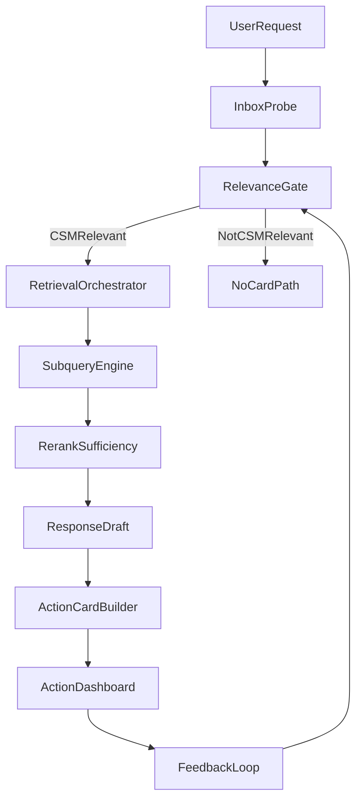

# Sova Architecture

This document explains the current high-level architecture for **Sova - CSM Radar Agent 24/7** and the intended behavior contract for future builds.

## System Components

- API app: `src/main.py`, `src/api/`
- Agent orchestration: `src/agent/email_agent.py`
- Search orchestration: `src/agent/tools/search_agent.py`
- Retrieval engines: `src/agent/tools/doc_search.py`
- Gmail integration: `src/agent/tools/gmail_tool.py` with local `gog` CLI
- Scheduler and cron: `src/scheduler/`, cron routes in `src/api/`
- Runtime config resolution: `src/runtime_config.py` and `src/config.py`
- Frontend console: `src/web/index.html`

## End-To-End Flow

## Retrieval As The Foundation

Search is the foundational capability for correct agent behavior:

- Query decomposition and term extraction run in `search_agent.py`.
- Recall combines RAG vector search, ripgrep lexical recall, and FTS.
- Candidate ranking uses scope-aware heuristics and LLM rerank.
- Sufficiency checks decide whether to refine and re-search.

Implementation details and tuning knobs live in [SEARCH_AGENT.md](SEARCH_AGENT.md).

## Behavior Boundaries

The architecture assumes two separate decisions:

1. **Relevance decision**: should this email/thread create a CSM action card?
2. **Response construction**: if relevant, what evidence-backed action should be proposed?

Guardrail policy is defined in [AGENT_GUARDRAILS.md](AGENT_GUARDRAILS.md).  
Action card schema and UX contract is defined in [ACTION_CARD_SPEC.md](ACTION_CARD_SPEC.md).

## Data And Persistence

- Runtime settings may be saved from Configure UI and override environment values.
- Knowledge sources include `knowledge-base/` and uploaded docs in app-managed storage.
- Action cards, history, and related metadata persist via the local database layer in `src/db/`.

## Prompts (important for developers)

Editable agent prompts are stored in **`app_settings`** (keys like `prompt_probe_mode_append`), not read directly from `src/agent/prompts.py` on every request. Repo defaults live in `prompts.py` and are seeded or reapplied via `src/agent/prompt_seed.py` and Configure. See [PROMPTS.md](PROMPTS.md) before changing prompt text or expecting upgrades to pick up edits automatically.

## Operational Interfaces

- Workbench: interactive runs and thread-focused work
- Action dashboard: cards, status progression, and follow-up context
- Cron: scheduled probing and processing
- History: traceability and feedback context

For production-like operations and troubleshooting, use [OPERATIONS_RUNBOOK.md](OPERATIONS_RUNBOOK.md).
